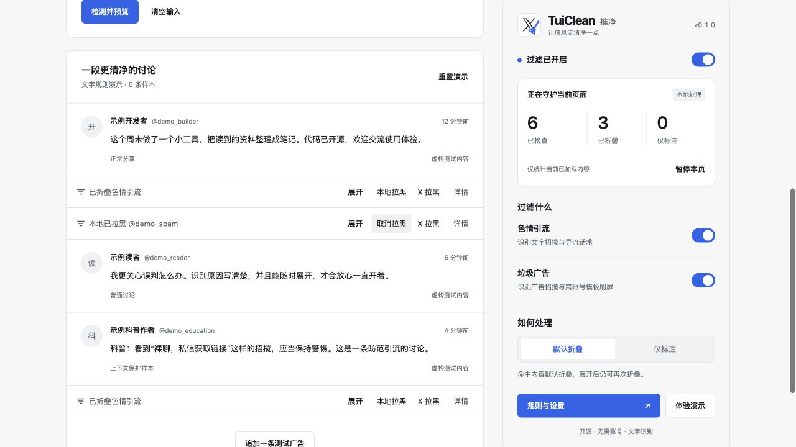

<p align="center">
  
</p>

<h1 align="center">TuiClean · 推净</h1>

<p align="center">把引流和刷屏折叠起来，让值得看的讨论留在眼前。</p>

<p align="center">
  <a href="https://github.com/murongg/TuiClean/releases"></a>
  <a href="#安装"></a>
  <a href="./LICENSE"></a>
</p>

<p align="center">
  <a href="#功能介绍">功能介绍</a> ·
  <a href="#安装">安装使用</a> ·
  <a href="#常见问题">常见问题</a> ·
  <a href="#反馈与参与">反馈与参与</a>
</p>

**TuiClean 是一款面向 X / Twitter 网页版的开源浏览器扩展。**

当评论区被色情引流、垃圾广告和重复话术占满时，TuiClean 会在你浏览的同时检查已加载内容，把命中的帖子折叠成一条简洁提示。正常讨论继续保留，折叠原因随时可查，想看原文也能一键展开。

**默认折叠 · 原因可见 · 随时恢复 · 本地处理**

## 界面预览



_截图来自体验页，账号和内容均为虚构样本。_

## 功能介绍

### 过滤色情引流与垃圾广告

从正文、显示昵称和可读取链接中寻找线索，覆盖成人招揽、站外引流、博彩、刷单等常见广告话术。

- **正文识别**：检查招揽词、联系入口及站外推荐中的组合线索。
- **昵称识别**：正文只有简单回复时，也能检查昵称中的明确招揽信息。昵称单独包含 NSFW 等通用标签，不会因此过滤普通回复；个人屏蔽关键词仍可匹配昵称。
- **独立开关**：色情引流与垃圾广告可以分别启用，每条内置规则也可以单独关闭。

当前主要识别中文话术，并包含部分英文关键词；图片、头像及视频画面尚不参与识别。

### 识别换了表情的模板刷屏

同一帖文详情里，不同账号反复发布相同的较长文字模板时，TuiClean 会将其标记为疑似刷屏。即使换了表情或插入空格，也能帮助发现重复刷屏。

只检查当前页面已经出现的回复，不追踪账号在其他页面的活动。重复内容会标为“疑似”，你仍可以自行决定是否保留。

### 折叠内容，保留选择权

命中项默认收起，提示条提供展开、再次折叠和查看依据的入口。

| 操作         | 效果                                   |
| ------------ | -------------------------------------- |
| 展开 / 折叠  | 随时切换原文可见性，提示条继续保留     |
| 详情         | 查看这条内容为什么被识别               |
| 不再提示这条 | 本次页面浏览中恢复原文并移除提示       |
| 信任此作者   | 加入本地白名单，让该作者的内容保持可见 |
| 仅标注       | 默认保留原文，由你决定是否折叠         |
| 暂停本页     | 暂停处理当前页面，切换页面后重新启用   |

### 一键拉黑，按账号管理

遇到不想再看到的作者，可以直接在提示条中选择拉黑方式。

|          | 本地拉黑                                     | X 拉黑                              |
| -------- | -------------------------------------------- | ----------------------------------- |
| 生效位置 | 当前浏览器中的 TuiClean                      | 你的 X 账号                         |
| 操作方式 | 点击后保存账号规则，折叠该作者的已加载内容   | 主动点击后，将作者加入你的 X 黑名单 |
| 如何取消 | 提示条点击“取消拉黑”，或在个人规则中移除账号 | 在 X 中取消拉黑                     |
| 两者关系 | 独立管理                                     | 不会自动加入 TuiClean 本地黑名单    |

本地拉黑会覆盖之前的单条展开状态，并先折叠该账号内容；之后仍可手动展开。白名单和过滤总开关优先。

规则匹配不会自动执行 X 拉黑。X 操作的最终结果以网站自身反馈为准。

### 让规则符合你的偏好

在「设置 → 个人规则」中，补充自己不想看到的内容：

| 规则类型       | 适合的场景                             |
| -------------- | -------------------------------------- |
| 屏蔽关键词     | 过滤正文或昵称中出现的特定词语         |
| 屏蔽域名       | 过滤带有指定域名及其子域名链接的内容   |
| 本地黑名单     | 按完整 @用户名屏蔽作者                 |
| 用户名匹配规则 | 按完整用户名或通配符匹配一类账号       |
| 账号白名单     | 保留信任作者的内容，优先于其他过滤规则 |

用户名规则每行一条，不区分大小写：

```text
@sample_user
demo_*
*_ads
```

上面的规则分别表示完整账号匹配、以 `demo_` 开头、以 `_ads` 结尾。`*` 可匹配零个或多个字符，也支持 `*sample*` 这样的包含匹配。

**用户名规则匹配的是 @ 后的账号 ID；如果要匹配显示昵称中的文字，请使用屏蔽关键词。** 请按示例填写，不能只填写 `*`。账号改名后，完整账号名单需要相应更新。

### 自己输入内容，直接看效果

打开「体验演示」，输入测试文字，可选填昵称和 @用户名，点击「检测并预览」，即可看到识别原因及折叠效果。

- 连续添加多条内容，可以测试跨账号模板检测。
- 调整演示中的过滤开关和个人规则，结果会立即更新。
- 支持展开、再次折叠、本地拉黑及恢复等操作。
- 从插件打开体验页时，自动读取已保存的扩展设置；在扩展设置页保存修改，已打开的体验页会同步更新识别结果。
- 输入、演示记录和本页试验只保留在当前页面，不修改扩展实际偏好。刷新或重置演示会恢复已保存的扩展设置。
- 本地网页演示使用独立设置，可在「查看完整设置 → 个人规则」保存测试关键词后返回检测。

体验页不执行真实的 X 拉黑；该操作需要在 X 页面主动使用。

### 回看拦截记录

点击弹窗中的「拦截记录」，或进入「设置 → 拦截记录」，即可查看最近命中过的帖子。

- **保留最近记录**：最多 1000 条或 4 MB，按首次记录时间倒序展示，同一条帖子去重。
- **原文可读**：显示拦截时保存的文字，长文可展开；单条最多 5000 字符，超长会提示。旧记录没有保存过原文。
- **原因可查**：记录 @账号、命中规则、原因及当时的折叠或标注状态。
- **快速处理**：按分类和规则筛选，跳转原帖，或将作者加入白名单。
- **自己掌控**：可以暂停新增记录或清空历史；清空不会更改黑名单和个人规则。

记录保存在当前浏览器中，重启后仍会保留。你可以回看拦截时的文字与原因，也可以通过完整备份带走这些记录。图片和视频不会保存在历史中；卸载扩展会删除本地记录。

体验页可测试历史查看和筛选流程，演示记录只保留在当前页面内存中。

### 本地处理，透明开源

内容识别在浏览器本地完成，个人规则和拦截记录保存在本机，不上传给 TuiClean 或第三方分析服务。只有你主动选择“X 拉黑”时，扩展才会向 X 提交账号操作。开启历史后只记录被识别的内容，不保存其他浏览记录。

「设置 → 数据与隐私」支持导出完整备份，包含关键词、名单、过滤偏好和拦截记录原文。导入时先预览再应用，配置会替换，历史会合并；旧版设置备份仍可导入。完整的数据处理方式见 [隐私说明](./PRIVACY.md)。

## 安装

当前版本为 **0.1.0**，采用手动安装方式。Chrome 是主要适配浏览器；Edge 可使用 Chrome 安装包，Firefox 提供单独的体验包。

安装包会通过 [版本下载](https://github.com/murongg/TuiClean/releases) 提供。若页面暂时没有安装包，请等待首次发布。

### Chrome / Edge

1. 下载 Chrome 安装包，解压到一个固定文件夹。
2. 打开浏览器的扩展管理页面：Chrome 使用 `chrome://extensions`，Edge 使用 `edge://extensions`。
3. 开启「开发者模式」，点击「加载已解压的扩展程序」，选择刚才解压的文件夹。
4. 刷新已经打开的 X 页面，即可开始使用。

### Firefox

Firefox 目前提供临时体验方式，尚未完成实际浏览器验证。

1. 下载并解压 Firefox 安装包。
2. 打开 `about:debugging#/runtime/this-firefox`，点击「临时载入附加组件」。
3. 选择解压文件夹中的 `manifest.json`。

临时加载的扩展在浏览器重启后需要重新加载。

### 更新已安装版本

**更新不需要卸载。** 卸载会清掉配置、名单和拦截记录。

1. 将新版安装包解压，覆盖到当前扩展使用的同一个文件夹。
2. 在浏览器扩展管理页面找到 TuiClean，点击「重新加载」。
3. 刷新 X 页面；已经打开的设置页和体验页也请关闭后重新打开。

需要重装或换设备时，先在「数据与隐私」中导出完整备份，安装后再导入。没有备份的已卸载数据无法恢复。

## 常见问题

<details>
<summary><strong>为什么有的内容没有被过滤？</strong></summary>

过滤可能漏掉改写过的话术、图片里的文字，或暂时无法读取的内容。

先检查扩展是否已重新加载、X 页面是否已刷新，以及相关分类开关、独立规则和生效范围是否开启。也可以在体验页复现，或添加个人关键词与账号规则。

</details>

<details>
<summary><strong>为什么相同正文有时处理不同？</strong></summary>

账号黑白名单和昵称线索也参与判断。“本地已拉黑”表示作者命中了你的账号名单，并不等同于正文规则命中。可以展开「详情」查看依据；白名单始终优先。完整招揽短句有独立规则，普通短回复不会仅因重复就被视为刷屏。

</details>

<details>
<summary><strong>误判了怎么办？</strong></summary>

可以展开原文，选择「不再提示这条」、信任作者，或在设置中关闭对应规则。昵称线索和重复模板属于疑似判断，不代表账号确定违规。

</details>

<details>
<summary><strong>“已提交 X 拉黑”是否代表拉黑成功？</strong></summary>

只有确认目标账号已被拉黑，才会显示成功。遇到网络中断或结果无法确认时，操作会停止；你可以到 X 查看实际结果后再决定是否重试。

取消本地拉黑、恢复默认设置或卸载扩展，都不会撤销 X 账号上的拉黑。

</details>

<details>
<summary><strong>设置会同步到其他设备吗？</strong></summary>

设置不会自动同步到其他设备。可以在「设置 → 数据与隐私」导出完整备份，再到另一处安装导入。完整备份包含配置、名单和拦截记录原文；旧版设置备份只包含设置与个人规则。

</details>

## 反馈与参与

欢迎通过 [Issues](https://github.com/murongg/TuiClean/issues) 反馈误判、漏判或使用建议。说明浏览器版本和遇到的情况，分享截图前请隐藏个人信息。

希望参与改进或翻译，可以查看 [贡献指南](./CONTRIBUTING.md)。

## 开源协议

项目代码使用 [MIT](./LICENSE) 协议。

TuiClean 是独立的第三方工具，与 X 官方无关联。Logo 图形来源见 [素材说明](./public/licenses/x.txt)。
